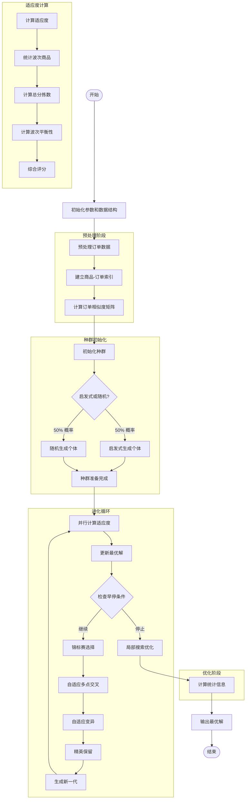
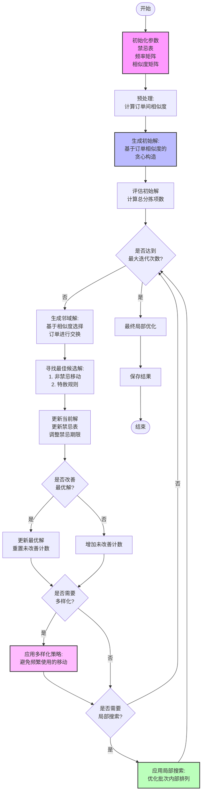

# Applied Statistic Homework (optional)

谢奕飞 2024215060


## 概述

在本次作业中，首先尝试了遗传算法求解，并对多点交叉、变异等算子进行了改进，但是结果并不理想，于是改用禁忌搜索算法求解，最终获得了可接受的订单分配方案。

源代码已上传Github：[BUAAxyf/SimpleOrderBatchingProblem: This project is designed to solve a simple OBP.](https://github.com/BUAAxyf/SimpleOrderBatchingProblem)

[TOC]

## 遗传算法

### 算法流程



ImprovedWaveOptimizer 的完整工作流程主要包含以下几个关键阶段：

1. **预处理阶段** (Preprocessing)
   - 初始化各种参数和数据结构
   - 建立商品和订单的关联索引
   - 计算订单之间的相似度矩阵

2. **种群初始化** (Initialization)
   - 使用双重策略创建初始种群
   - 50%概率使用启发式方法
   - 50%概率使用随机生成方法

3. **进化循环** (Evolution)
   - 并行计算种群适应度
   - 更新最优解
   - 检查早停条件
   - 通过锦标赛选择父代
   - 执行自适应多点交叉
   - 执行自适应变异
   - 保留精英个体

4. **最终优化** (Optimization)
   - 对最优解进行局部搜索优化
   - 计算详细的统计信息

5. **适应度计算** (Fitness)
   - 统计每个波次的商品
   - 计算总分拣数
   - 计算波次平衡性
   - 生成综合评分

### 核心功能

#### 数据预处理

```python
def preprocess_orders(self):
    # 建立商品-订单和订单-商品的双向索引
    self.product_to_orders = defaultdict(set)
    self.order_to_products = defaultdict(set)
    
    # 构建订单相似度矩阵
    self.calculate_order_similarity()
```

关键优化点：

- 使用哈希表存储索引，提供 O(1) 的查询效率
- 预计算订单相似度，避免重复计算

#### 智能初始化

算法采用双重初始化策略：

1. 启发式初始化（50%概率）：

```python
def create_heuristic_individual(self):
    # 基于订单相似度的贪心分配
    while available_orders and current_wave < self.n_waves:
        seed = random.choice(list(available_orders))
        similarities = [(i, self.similarity_matrix[seed, i])
                       for i in available_orders]
        similarities.sort(key=lambda x: x[1], reverse=True)
```

2. 随机初始化（50%概率）：

```python
def create_random_individual(self):
    return [random.randint(0, self.n_waves - 1) 
            for _ in range(len(self.order_ids))]
```

#### 适应度计算

多目标适应度函数设计：

```python
def calculate_fitness(self, individual):
    # 计算总分拣数
    total_picking = sum(len(products) for products in wave_products)
    
    # 计算波次平衡性
    balance_penalty = np.std([len(orders) for orders in wave_orders])
    
    # 综合评分
    score = total_picking + balance_penalty * 10
    return 1.0 / (score + 1)
```

##### 进化操作

1. 自适应多点交叉：

```python
def adaptive_crossover(self, parent1, parent2):
    n_points = random.randint(1, 3)  # 动态交叉点数量
    points = sorted(random.sample(range(1, len(parent1)), n_points))
```

2. 自适应变异：

```python
def adaptive_mutation(self, individual, generation):
    current_mutation_rate = self.mutation_rate * \
                          (1 - generation / self.n_generations)
```

##### 局部搜索优化

在获得最优解后，进行局部搜索进一步优化：

```python
def local_search(self, solution):
    while improved:
        for i in range(len(solution)):
            for new_wave in range(self.n_waves):
                # 尝试将订单移动到其他波次
                if current_picking < best_picking:
                    best_picking = current_picking
                    best_wave = new_wave
                    improved = True
```

### 性能优化

#### 并行计算

使用 ProcessPoolExecutor 实现并行fitness计算：

```python
def parallel_fitness_calculation(self, population):
    with ProcessPoolExecutor(max_workers=self.n_processes) as executor:
        fitness_scores = list(executor.map(self.calculate_fitness, 
                                         population))
```

#### 早停机制

```python
if generations_without_improvement >= 20:
    print(f"Early stopping at generation {generation}")
    break
```

#### 内存优化

- 使用集合（set）存储商品列表，减少内存占用
- 采用索引方式存储订单分配方案

### 参数设置

```
n_waves=100,  # 波次数量
population_size=200  # 种群大小，建议设置为订单数量的2倍
n_generations=300  # 迭代代数
mutation_rate=0.3  # 变异率
elite_size=20  # 精英个体数量
crossover_rate=0.8  # 交叉概率
tournament_size=5  # 锦标赛选择的参与者数量
n_processes=None  # 并行进程数，默认使用所有CPU核心
```

| 参数名称         | 默认值        | 说明                                               |
|------------------|---------------|----------------------------------------------------|
| `n_waves`        | 100           | 波次数量                                           |
| `population_size`| 200           | 种群大小，建议设置为订单数量的2倍                 |
| `n_generations`  | 300           | 迭代代数                                           |
| `mutation_rate`  | 0.3           | 变异率                                             |
| `elite_size`     | 20            | 精英个体数量                                       |
| `crossover_rate` | 0.8           | 交叉概率                                           |
| `tournament_size`| 5             | 锦标赛选择的参与者数量                           |
| `n_processes`    | None          | 并行进程数，默认使用所有CPU核心                   |


### 结果分析

经过三次求解，遗传算法求得的最优解停留在了9750，结果并不理想，因此尝试禁忌搜索算法进行求解

## 禁忌搜索算法

### 算法流程



### 参数设置

| 参数类别     | 参数名称                  | 默认值 | 说明                                   |
| ------------ | ------------------------- | ------ | -------------------------------------- |
| **基础配置** | batch_size                | 16     | 每个波次包含的订单数量                 |
|              | num_batches               | 100    | 波次总数                               |
| **搜索控制** | max_iterations            | 1500   | 最大迭代次数                           |
|              | min_tabu_tenure           | 10     | 最小禁忌期限                           |
|              | max_tabu_tenure           | 30     | 最大禁忌期限                           |
| **策略参数** | diversification_threshold | 100    | 多样化策略触发阈值                     |
| **隐含参数** | 局部搜索频率              | 50     | 每隔多少次迭代执行一次局部搜索         |
|              | 提前终止条件              | 200    | 连续多少次迭代无改善时终止             |
|              | 搜索强度                  | 5-20   | 每次迭代考虑的批次数量范围，随迭代递减 |

### 运行结果

```
100%|██████████| 1500/1500 [27:35<00:00,  1.10s/it]
运行时间: 1660.69秒
迭代次数: 1500
最终总分拣项数: 8362
```

结果得到了很大改进，具体方案详见附录——最优方案。

## 运行环境

| 环境     | 型号                                   |              |
| -------- | -------------------------------------- | ------------ |
| 处理器   | AMD Ryzen 7 4800H with Radeon Graphics | 2.90 GHz     |
| 机带 RAM | 16.0 GB                                | 15.9 GB 可用 |
| 操作系统 | Windows 10 家庭中文版                  |              |
| 编程语言 | Python 3.10                            | 虚拟环境     |

## 附录

### 遗传算法模块

```python
import random
import numpy as np
from typing import Dict, List, Set, Tuple
from collections import defaultdict
import time
from concurrent.futures import ProcessPoolExecutor
import multiprocessing


class ImprovedWaveOptimizer:
    def __init__(self, order_dict: Dict[str, List[str]], n_waves: int = None,
                 population_size: int = 100, n_generations: int = 200,
                 mutation_rate: float = 0.1, elite_size: int = 10,
                 crossover_rate: float = 0.8, tournament_size: int = 5,
                 n_processes: int = None):
        """
        改进版波次优化器，确保每个波次有16个订单

        Args:
            order_dict: 订单字典
            n_waves: 波次数量（将根据订单总数自动计算）
            population_size: 种群大小
            n_generations: 迭代代数
            mutation_rate: 变异率
            elite_size: 精英个体数量
            crossover_rate: 交叉概率
            tournament_size: 锦标赛选择的参与者数量
            n_processes: 并行进程数，默认为CPU核心数
        """
        self.order_dict = order_dict
        # 计算需要的波次数量，确保每波16个订单
        total_orders = len(order_dict)
        self.n_waves = n_waves or (total_orders + 15) // 16
        if total_orders % 16 != 0:
            raise ValueError(f"订单总数（{total_orders}）必须是16的倍数")

        self.population_size = population_size
        self.n_generations = n_generations
        self.mutation_rate = mutation_rate
        self.elite_size = elite_size
        self.crossover_rate = crossover_rate
        self.tournament_size = tournament_size
        self.order_ids = list(order_dict.keys())
        self.n_processes = n_processes or multiprocessing.cpu_count()

        # 预处理订单数据
        self.preprocess_orders()

    def create_individual(self) -> List[int]:
        """
        创建一个个体，确保每个波次恰好有16个订单
        """
        if random.random() < 0.5:  # 50%概率使用启发式方法
            return self.create_heuristic_individual()
        return self.create_balanced_random_individual()

    def create_balanced_random_individual(self) -> List[int]:
        """
        创建平衡的随机个体，确保每个波次恰好有16个订单
        """
        assignment = []
        for wave in range(self.n_waves):
            assignment.extend([wave] * 16)
        random.shuffle(assignment)
        return assignment

    def create_heuristic_individual(self) -> List[int]:
        """
        使用启发式方法创建个体，确保每个波次恰好有16个订单
        """
        n_orders = len(self.order_ids)
        assignment = [-1] * n_orders
        available_orders = set(range(n_orders))
        orders_per_wave = {i: [] for i in range(self.n_waves)}

        for wave in range(self.n_waves):
            # 如果还有未分配的订单
            while len(orders_per_wave[wave]) < 16 and available_orders:
                if not orders_per_wave[wave]:  # 波次为空，随机选择种子订单
                    seed = random.choice(list(available_orders))
                    orders_per_wave[wave].append(seed)
                    available_orders.remove(seed)
                    assignment[seed] = wave
                else:
                    # 基于相似度选择下一个订单
                    current_orders = orders_per_wave[wave]
                    best_similarity = -1
                    best_order = None

                    for order in available_orders:
                        avg_similarity = np.mean([self.similarity_matrix[order, curr]
                                                  for curr in current_orders])
                        if avg_similarity > best_similarity:
                            best_similarity = avg_similarity
                            best_order = order

                    if best_order is not None:
                        orders_per_wave[wave].append(best_order)
                        available_orders.remove(best_order)
                        assignment[best_order] = wave

        return assignment

    def adaptive_crossover(self, parent1: List[int], parent2: List[int]) -> Tuple[List[int], List[int]]:
        """
        修改后的交叉操作，保持每个波次16个订单的平衡
        """
        if random.random() > self.crossover_rate:
            return parent1.copy(), parent2.copy()

        child1 = [-1] * len(parent1)
        child2 = [-1] * len(parent1)

        # 随机选择交叉点，必须是16的倍数
        crossover_point = random.randint(1, self.n_waves - 1) * 16

        # 复制前半部分
        wave_counts1 = defaultdict(int)
        wave_counts2 = defaultdict(int)

        # 复制交叉点之前的部分
        for i in range(crossover_point):
            child1[i] = parent1[i]
            child2[i] = parent2[i]
            wave_counts1[parent1[i]] += 1
            wave_counts2[parent2[i]] += 1

        # 填充剩余部分，确保每个波次都有16个订单
        remaining_pos1 = list(range(crossover_point, len(parent1)))
        remaining_pos2 = list(range(crossover_point, len(parent2)))

        for i in range(self.n_waves):
            remaining1 = 16 - wave_counts1[i]
            remaining2 = 16 - wave_counts2[i]

            # 为child1选择合适的位置
            positions1 = remaining_pos1[:remaining1]
            remaining_pos1 = remaining_pos1[remaining1:]
            for pos in positions1:
                child1[pos] = i

            # 为child2选择合适的位置
            positions2 = remaining_pos2[:remaining2]
            remaining_pos2 = remaining_pos2[remaining2:]
            for pos in positions2:
                child2[pos] = i

        return child1, child2

    def adaptive_mutation(self, individual: List[int], generation: int) -> None:
        """
        修改后的变异操作，保持每个波次16个订单的平衡
        """
        current_mutation_rate = self.mutation_rate * (1 - generation / self.n_generations)

        for i in range(len(individual)):
            if random.random() < current_mutation_rate:
                # 找到另一个波次中的一个位置进行交换
                current_wave = individual[i]
                other_wave = random.randint(0, self.n_waves - 1)
                if other_wave == current_wave:
                    continue

                # 找到属于other_wave的一个随机位置
                swap_candidates = [j for j, wave in enumerate(individual) if wave == other_wave]
                if swap_candidates:
                    j = random.choice(swap_candidates)
                    individual[i], individual[j] = individual[j], individual[i]

    def calculate_fitness(self, individual: List[int]) -> float:
        """
        计算适应度，增加对波次订单数量平衡的惩罚项
        """
        wave_products = [set() for _ in range(self.n_waves)]
        wave_orders = [[] for _ in range(self.n_waves)]

        # 统计每个波次的商品和订单
        for order_idx, wave_idx in enumerate(individual):
            order_id = self.order_ids[order_idx]
            products = self.order_dict[order_id]
            wave_products[wave_idx].update(products)
            wave_orders[wave_idx].append(order_id)

        # 检查每个波次是否恰好有16个订单
        for orders in wave_orders:
            if len(orders) != 16:
                return 0.0  # 严重惩罚不满足约束的解

        # 计算总分拣数
        total_picking = sum(len(products) for products in wave_products)

        # 计算波次间商品数量的平衡性
        products_per_wave = [len(products) for products in wave_products]
        balance_penalty = np.std(products_per_wave) if products_per_wave else 0

        # 综合评分（越小越好）
        score = total_picking + balance_penalty * 10

        return 1.0 / (score + 1)

# import random
# import numpy as np
# from typing import Dict, List, Set, Tuple
# from collections import defaultdict
# import time
# from concurrent.futures import ProcessPoolExecutor
# import multiprocessing
#
#
# class ImprovedWaveOptimizer:
#     def __init__(self, order_dict: Dict[str, List[str]], n_waves: int = 100,
#                  population_size: int = 100, n_generations: int = 200,
#                  mutation_rate: float = 0.1, elite_size: int = 10,
#                  crossover_rate: float = 0.8, tournament_size: int = 5,
#                  n_processes: int = None):
#         """
#         改进版波次优化器
#
#         Args:
#             order_dict: 订单字典
#             n_waves: 波次数量
#             population_size: 种群大小
#             n_generations: 迭代代数
#             mutation_rate: 变异率
#             elite_size: 精英个体数量
#             crossover_rate: 交叉概率
#             tournament_size: 锦标赛选择的参与者数量
#             n_processes: 并行进程数，默认为CPU核心数
#         """
#         self.order_dict = order_dict
#         self.n_waves = n_waves
#         self.population_size = population_size
#         self.n_generations = n_generations
#         self.mutation_rate = mutation_rate
#         self.elite_size = elite_size
#         self.crossover_rate = crossover_rate
#         self.tournament_size = tournament_size
#         self.order_ids = list(order_dict.keys())
#         self.n_processes = n_processes or multiprocessing.cpu_count()
#
#         # 预处理订单数据
#         self.preprocess_orders()
#
    def preprocess_orders(self):
        """
        预处理订单数据，建立商品和订单的关联索引
        """
        self.product_to_orders = defaultdict(set)
        self.order_to_products = defaultdict(set)

        for order_id, products in self.order_dict.items():
            self.order_to_products[order_id] = set(products)
            for product in products:
                self.product_to_orders[product].add(order_id)

        # 计算订单相似度矩阵
        self.calculate_order_similarity()

    def calculate_order_similarity(self):
        """
        计算订单间的相似度矩阵，用于启发式分配
        """
        n_orders = len(self.order_ids)
        self.similarity_matrix = np.zeros((n_orders, n_orders))

        for i in range(n_orders):
            for j in range(i + 1, n_orders):
                order1 = self.order_to_products[self.order_ids[i]]
                order2 = self.order_to_products[self.order_ids[j]]

                # 使用Jaccard相似度
                similarity = len(order1 & order2) / len(order1 | order2)
                self.similarity_matrix[i, j] = similarity
                self.similarity_matrix[j, i] = similarity

#     def create_individual(self) -> List[int]:
#         """
#         创建一个个体，使用启发式方法
#         """
#         if random.random() < 0.5:  # 50%概率使用启发式方法
#             return self.create_heuristic_individual()
#         return self.create_random_individual()
#
#     def create_random_individual(self) -> List[int]:
#         """
#         随机创建个体
#         """
#         return [random.randint(0, self.n_waves - 1) for _ in range(len(self.order_ids))]
#
#     def create_heuristic_individual(self) -> List[int]:
#         """
#         使用启发式方法创建个体，将相似订单分配到同一波次
#         """
#         n_orders = len(self.order_ids)
#         assignment = [-1] * n_orders
#         available_orders = set(range(n_orders))
#         current_wave = 0
#
#         while available_orders and current_wave < self.n_waves:
#             # 随机选择一个未分配的订单作为种子
#             seed = random.choice(list(available_orders))
#             available_orders.remove(seed)
#             assignment[seed] = current_wave
#
#             # 根据相似度选择相近的订单
#             similarities = [(i, self.similarity_matrix[seed, i])
#                             for i in available_orders]
#             similarities.sort(key=lambda x: x[1], reverse=True)
#
#             # 将相似订单分配到当前波次
#             for order_idx, sim in similarities:
#                 if sim > 0.3:  # 相似度阈值
#                     assignment[order_idx] = current_wave
#                     available_orders.remove(order_idx)
#
#             current_wave += 1
#
#         # 将剩余订单随机分配
#         for order_idx in available_orders:
#             assignment[order_idx] = random.randint(0, self.n_waves - 1)
#
#         return assignment
#
#     def calculate_fitness(self, individual: List[int]) -> float:
#         """
#         计算适应度，考虑多个目标
#         """
#         wave_products = [set() for _ in range(self.n_waves)]
#         wave_orders = [[] for _ in range(self.n_waves)]
#
#         # 统计每个波次的商品和订单
#         for order_idx, wave_idx in enumerate(individual):
#             order_id = self.order_ids[order_idx]
#             products = self.order_dict[order_id]
#             wave_products[wave_idx].update(products)
#             wave_orders[wave_idx].append(order_id)
#
#         # 计算总分拣数
#         total_picking = sum(len(products) for products in wave_products)
#
#         # 计算波次间的平衡性（订单数量的标准差）
#         orders_per_wave = [len(orders) for orders in wave_orders]
#         balance_penalty = np.std(orders_per_wave) if orders_per_wave else 0
#
#         # 综合评分（越小越好）
#         score = total_picking + balance_penalty * 10
#
#         return 1.0 / (score + 1)
#
#     def parallel_fitness_calculation(self, population: List[List[int]]) -> List[float]:
#         """
#         并行计算种群适应度
#         """
#         with ProcessPoolExecutor(max_workers=self.n_processes) as executor:
#             fitness_scores = list(executor.map(self.calculate_fitness, population))
#         return fitness_scores
#
    def tournament_selection(self, population: List[List[int]],
                             fitness_scores: List[float]) -> List[int]:
        """
        改进的锦标赛选择
        """
        tournament_idx = random.sample(range(len(population)), self.tournament_size)
        tournament_fitness = [fitness_scores[idx] for idx in tournament_idx]
        winner_idx = tournament_idx[np.argmax(tournament_fitness)]
        return population[winner_idx].copy()
#
#     def adaptive_crossover(self, parent1: List[int], parent2: List[int]) -> Tuple[List[int], List[int]]:
#         """
#         自适应多点交叉
#         """
#         if random.random() > self.crossover_rate:
#             return parent1, parent2
#
#         n_points = random.randint(1, 3)  # 1-3个交叉点
#         points = sorted(random.sample(range(1, len(parent1)), n_points))
#
#         child1, child2 = [], []
#         start = 0
#         swap = True
#
#         for point in points + [len(parent1)]:
#             if swap:
#                 child1.extend(parent1[start:point])
#                 child2.extend(parent2[start:point])
#             else:
#                 child1.extend(parent2[start:point])
#                 child2.extend(parent1[start:point])
#             swap = not swap
#             start = point
#
#         return child1, child2
#
#     def adaptive_mutation(self, individual: List[int], generation: int) -> None:
#         """
#         自适应变异
#         """
#         # 根据进化代数调整变异率
#         current_mutation_rate = self.mutation_rate * (1 - generation / self.n_generations)
#
#         for i in range(len(individual)):
#             if random.random() < current_mutation_rate:
#                 # 局部搜索：倾向于分配到相邻波次
#                 current_wave = individual[i]
#                 new_wave = current_wave + random.choice([-1, 1])
#                 new_wave = max(0, min(new_wave, self.n_waves - 1))
#                 individual[i] = new_wave
#
    def local_search(self, solution: List[int]) -> List[int]:
        """
        局部搜索优化
        """
        improved = True
        best_picking = self.get_total_picking(solution)

        while improved:
            improved = False
            for i in range(len(solution)):
                original_wave = solution[i]
                best_wave = original_wave

                # 尝试将订单移动到其他波次
                for new_wave in range(self.n_waves):
                    if new_wave == original_wave:
                        continue

                    solution[i] = new_wave
                    current_picking = self.get_total_picking(solution)

                    if current_picking < best_picking:
                        best_picking = current_picking
                        best_wave = new_wave
                        improved = True

                solution[i] = best_wave

        return solution

    def optimize(self) -> tuple:
        """
        运行优化算法
        """
        start_time = time.time()

        # 初始化种群
        population = [self.create_individual() for _ in range(self.population_size)]

        best_solution = None
        best_fitness = float('-inf')
        generations_without_improvement = 0

        for generation in range(self.n_generations):
            # 并行计算适应度
            fitness_scores = self.parallel_fitness_calculation(population)

            # 更新最优解
            max_fitness_idx = np.argmax(fitness_scores)
            if fitness_scores[max_fitness_idx] > best_fitness:
                best_fitness = fitness_scores[max_fitness_idx]
                best_solution = population[max_fitness_idx].copy()
                generations_without_improvement = 0
            else:
                generations_without_improvement += 1

            # 早停机制
            if generations_without_improvement >= 20:
                print(f"Early stopping at generation {generation}")
                break

            # 精英保留
            elite = sorted(zip(fitness_scores, population), reverse=True)[:self.elite_size]
            new_population = [ind for _, ind in elite]

            # 生成新一代
            while len(new_population) < self.population_size:
                parent1 = self.tournament_selection(population, fitness_scores)
                parent2 = self.tournament_selection(population, fitness_scores)
                child1, child2 = self.adaptive_crossover(parent1, parent2)

                self.adaptive_mutation(child1, generation)
                self.adaptive_mutation(child2, generation)

                new_population.extend([child1, child2])

            population = new_population[:self.population_size]

            if generation % 10 == 0:
                best_picking = self.get_total_picking(best_solution)
                elapsed_time = time.time() - start_time
                print(f"Generation {generation}: Best picking = {best_picking}, "
                      f"Time elapsed: {elapsed_time:.2f}s")

        # 对最优解进行局部搜索优化
        best_solution = self.local_search(best_solution)
        final_picking = self.get_total_picking(best_solution)

        return best_solution, final_picking

    def get_total_picking(self, solution: List[int]) -> int:
        """
        计算总分拣数
        """
        wave_products = [set() for _ in range(self.n_waves)]
        for order_idx, wave_idx in enumerate(solution):
            order_id = self.order_ids[order_idx]
            products = self.order_dict[order_id]
            wave_products[wave_idx].update(products)

        return sum(len(products) for products in wave_products)

    def get_wave_assignments(self, solution: List[int]) -> Dict[int, List[str]]:
        """
        获取波次分配方案
        """
        wave_assignments = {i: [] for i in range(self.n_waves)}
        for order_idx, wave_idx in enumerate(solution):
            order_id = self.order_ids[order_idx]
            wave_assignments[wave_idx].append(order_id)
        return wave_assignments

    def get_statistics(self, solution: List[int]) -> Dict:
        """
        获取解决方案的详细统计信息
        """
        wave_assignments = self.get_wave_assignments(solution)
        wave_products = [set() for _ in range(self.n_waves)]
        wave_order_counts = []

        for wave_idx, orders in wave_assignments.items():
            wave_order_counts.append(len(orders))
            for order_id in orders:
                products = self.order_dict[order_id]
                wave_products[wave_idx].update(products)

        stats = {
            'total_picking': sum(len(products) for products in wave_products),
            'avg_picking_per_wave': np.mean([len(products) for products in wave_products]),
            'max_picking_per_wave': max(len(products) for products in wave_products),
            'min_picking_per_wave': min(len(products) for products in wave_products),
            'std_picking_per_wave': np.std([len(products) for products in wave_products]),
            'avg_orders_per_wave': np.mean(wave_order_counts),
            'std_orders_per_wave': np.std(wave_order_counts),
            'empty_waves': sum(1 for products in wave_products if not products),
            'utilized_waves': sum(1 for products in wave_products if products)
        }

        return stats

```


### 禁忌搜索模块

```python
import random
from collections import defaultdict, Counter
from typing import List, Dict, Set, Tuple
import time
import numpy as np
from tqdm import tqdm

class ImprovedTabuSearch:
    def __init__(self, order_dict: Dict[str, List[str]],
                 batch_size: int = 16,
                 num_batches: int = 100,
                 max_iterations: int = 1500,
                 min_tabu_tenure: int = 10,
                 max_tabu_tenure: int = 30,
                 diversification_threshold: int = 100):
        """
        初始化优化后的禁忌搜索算法

        Args:
            order_dict: 订单字典，key为订单ID，value为商品列表
            batch_size: 每个波次包含的订单数量
            num_batches: 波次总数
            max_iterations: 最大迭代次数
            min_tabu_tenure: 最小禁忌期限
            max_tabu_tenure: 最大禁忌期限
            diversification_threshold: 触发多样化策略的阈值
        """
        self.order_dict = order_dict
        self.batch_size = batch_size
        self.num_batches = num_batches
        self.max_iterations = max_iterations
        self.min_tabu_tenure = min_tabu_tenure
        self.max_tabu_tenure = max_tabu_tenure
        self.diversification_threshold = diversification_threshold

        self.tabu_list = {}  # 改用字典存储禁忌移动及其剩余期限
        self.frequency_matrix = defaultdict(int)  # 记录移动频率
        self.best_solution = None
        self.best_cost = float('inf')

        # 预处理订单相似度
        self.similarity_matrix = self._calculate_order_similarity()

    def _calculate_order_similarity(self) -> Dict[Tuple[str, str], float]:
        """计算订单间的相似度"""
        similarity = {}
        orders = list(self.order_dict.keys())

        for i, order1 in enumerate(orders):
            items1 = set(self.order_dict[order1])
            for order2 in orders[i + 1:]:
                items2 = set(self.order_dict[order2])
                # 使用Jaccard相似度
                similarity[(order1, order2)] = len(items1 & items2) / len(items1 | items2)
                similarity[(order2, order1)] = similarity[(order1, order2)]

        return similarity

    def _get_order_similarity(self, order1: str, order2: str) -> float:
        """获取两个订单的相似度"""
        return self.similarity_matrix.get((order1, order2), 0)

    def generate_initial_solution(self) -> List[List[str]]:
        """生成优化的初始解：基于订单相似度的贪心构造"""
        orders = list(self.order_dict.keys())
        solution = []
        remaining_orders = set(orders)

        while remaining_orders:
            # 开始新的批次
            batch = []
            if not batch:
                # 随机选择第一个订单
                first_order = random.choice(list(remaining_orders))
                batch.append(first_order)
                remaining_orders.remove(first_order)

            # 基于相似度填充批次
            while len(batch) < self.batch_size and remaining_orders:
                best_similarity = -1
                best_order = None

                # 计算当前批次与剩余订单的平均相似度
                for order in remaining_orders:
                    avg_similarity = sum(self._get_order_similarity(order, o) for o in batch) / len(batch)
                    if avg_similarity > best_similarity:
                        best_similarity = avg_similarity
                        best_order = order

                if best_order:
                    batch.append(best_order)
                    remaining_orders.remove(best_order)
                else:
                    break

            solution.append(batch)

        return solution

    def calculate_picking_items(self, batch: List[str]) -> int:
        """计算单个波次的分拣项数"""
        unique_items = set()
        for order_id in batch:
            unique_items.update(self.order_dict[order_id])
        return len(unique_items)

    def evaluate_solution(self, solution: List[List[str]]) -> int:
        """评估解的总分拣项数"""
        return sum(self.calculate_picking_items(batch) for batch in solution)

    def get_neighbors(self, solution: List[List[str]], iteration: int) -> List[Tuple[List[List[str]], Tuple]]:
        """获取改进的邻域解"""
        neighbors = []

        # 动态调整搜索强度
        search_intensity = max(5, min(20, 20 - iteration // 100))
        batch_indices = random.sample(range(len(solution)), min(search_intensity, len(solution)))

        for i in batch_indices:
            for j in range(len(solution)):
                if i == j:
                    continue

                # 选择相似度最低的订单进行交换
                batch_i = solution[i]
                batch_j = solution[j]

                # 计算批次内订单的平均相似度
                avg_sim_i = self._calculate_batch_similarity(batch_i)
                avg_sim_j = self._calculate_batch_similarity(batch_j)

                # 选择相似度较低的订单进行交换
                order_i = self._select_dissimilar_order(batch_i)
                order_j = self._select_dissimilar_order(batch_j)

                # 生成新解
                new_solution = [batch[:] for batch in solution]
                new_solution[i][new_solution[i].index(order_i)] = order_j
                new_solution[j][new_solution[j].index(order_j)] = order_i

                # 记录移动
                move = (order_i, order_j)
                neighbors.append((new_solution, move))

        return neighbors

    def _calculate_batch_similarity(self, batch: List[str]) -> float:
        """计算批次内订单的平均相似度"""
        if len(batch) < 2:
            return 0

        similarities = []
        for i, order1 in enumerate(batch):
            for order2 in batch[i + 1:]:
                similarities.append(self._get_order_similarity(order1, order2))

        return sum(similarities) / len(similarities) if similarities else 0

    def _select_dissimilar_order(self, batch: List[str]) -> str:
        """选择批次中相似度最低的订单"""
        min_similarity = float('inf')
        selected_order = random.choice(batch)

        for order in batch:
            avg_similarity = sum(self._get_order_similarity(order, o) for o in batch if o != order) / (len(batch) - 1)
            if avg_similarity < min_similarity:
                min_similarity = avg_similarity
                selected_order = order

        return selected_order

    def _adjust_tabu_tenure(self, improvement: bool):
        """动态调整禁忌期限"""
        if improvement:
            self.current_tabu_tenure = max(self.min_tabu_tenure,
                                           self.current_tabu_tenure - 1)
        else:
            self.current_tabu_tenure = min(self.max_tabu_tenure,
                                           self.current_tabu_tenure + 1)

    def is_tabu(self, move: Tuple) -> bool:
        """检查移动是否在禁忌列表中"""
        return move in self.tabu_list or (move[1], move[0]) in self.tabu_list

    def update_tabu_list(self, move: Tuple):
        """更新禁忌列表"""
        self.tabu_list[move] = self.current_tabu_tenure
        self.frequency_matrix[move] += 1

        # 更新禁忌期限
        keys_to_remove = []
        for key in self.tabu_list:
            self.tabu_list[key] -= 1
            if self.tabu_list[key] <= 0:
                keys_to_remove.append(key)

        for key in keys_to_remove:
            del self.tabu_list[key]

    def apply_diversification(self, solution: List[List[str]]) -> List[List[str]]:
        """应用多样化策略"""
        # 找出使用频率最高的移动
        frequent_moves = sorted(self.frequency_matrix.items(),
                                key=lambda x: x[1],
                                reverse=True)[:10]

        # 尝试避免这些频繁移动
        new_solution = [batch[:] for batch in solution]
        for (order1, order2), _ in frequent_moves:
            # 在不同批次中找到这些订单
            batch1 = None
            batch2 = None
            for i, batch in enumerate(new_solution):
                if order1 in batch:
                    batch1 = i
                if order2 in batch:
                    batch2 = i

            if batch1 is not None and batch2 is not None and batch1 != batch2:
                # 随机选择其他订单进行交换
                other_order1 = random.choice([o for o in new_solution[batch1] if o != order1])
                other_order2 = random.choice([o for o in new_solution[batch2] if o != order2])

                # 交换订单
                new_solution[batch1][new_solution[batch1].index(order1)] = other_order2
                new_solution[batch2][new_solution[batch2].index(other_order2)] = order1

        return new_solution

    def local_search(self, solution: List[List[str]]) -> List[List[str]]:
        """应用局部搜索优化"""
        improved = True
        current_solution = [batch[:] for batch in solution]

        while improved:
            improved = False
            current_cost = self.evaluate_solution(current_solution)

            # 尝试在每个批次内部重新排列订单
            for i in range(len(current_solution)):
                batch = current_solution[i]
                best_arrangement = batch
                best_cost = self.calculate_picking_items(batch)

                # 尝试不同的排列
                for _ in range(min(20, len(batch))):
                    new_arrangement = batch[:]
                    random.shuffle(new_arrangement)
                    new_cost = self.calculate_picking_items(new_arrangement)

                    if new_cost < best_cost:
                        best_arrangement = new_arrangement
                        best_cost = new_cost
                        improved = True

                current_solution[i] = best_arrangement

        return current_solution

    def solve(self) -> Tuple[List[List[str]], int]:
        """运行优化后的禁忌搜索算法"""
        start_time = time.time()

        # 生成初始解
        current_solution = self.generate_initial_solution()
        current_cost = self.evaluate_solution(current_solution)

        self.best_solution = current_solution
        self.best_cost = current_cost

        # 初始化当前禁忌期限
        self.current_tabu_tenure = self.min_tabu_tenure

        # 记录没有改善的迭代次数
        no_improvement = 0

        for iteration in tqdm(range(self.max_iterations)):
            # 获取邻域解
            neighbors = self.get_neighbors(current_solution, iteration)

            # 找到最佳非禁忌移动或满足特赦规则的移动
            best_neighbor = None
            best_neighbor_cost = float('inf')

            for neighbor, move in neighbors:
                neighbor_cost = self.evaluate_solution(neighbor)

                if (not self.is_tabu(move) and neighbor_cost < best_neighbor_cost) or \
                        (neighbor_cost < self.best_cost):  # 特赦规则
                    best_neighbor = neighbor
                    best_neighbor_cost = neighbor_cost
                    best_move = move

            if best_neighbor is None:
                continue

            # 更新当前解
            current_solution = best_neighbor
            current_cost = best_neighbor_cost

            # 更新禁忌列表并调整禁忌期限
            self.update_tabu_list(best_move)

            # 更新最优解
            if current_cost < self.best_cost:
                self.best_solution = current_solution
                self.best_cost = current_cost
                no_improvement = 0
                self._adjust_tabu_tenure(True)
            else:
                no_improvement += 1
                self._adjust_tabu_tenure(False)

            # 应用多样化策略
            if no_improvement >= self.diversification_threshold:
                current_solution = self.apply_diversification(current_solution)
                current_cost = self.evaluate_solution(current_solution)
                no_improvement = 0

            # 定期应用局部搜索
            if iteration % 50 == 0:
                current_solution = self.local_search(current_solution)
                current_cost = self.evaluate_solution(current_solution)

            # 如果连续200次迭代没有改善，提前终止
            if no_improvement >= 200:
                break

        # 最终优化
        self.best_solution = self.local_search(self.best_solution)
        self.best_cost = self.evaluate_solution(self.best_solution)

        end_time = time.time()
        print(f"运行时间: {end_time - start_time:.2f}秒")
        print(f"迭代次数: {iteration + 1}")
        print(f"最终总分拣项数: {self.best_cost}")

        return self.best_solution, self.best_cost


# def save_solution(solution: List[List[str]],
#                   cost: int,
#                   order_dict: Dict[str, List[str]],
#                   filename: str):
#     """保存结果到文件"""
```

### 最优方案

```csv
波次序号,订单编号,分拣项数
1,D1549|D600|D739|D12|D173|D1193|D6|D1519|D110|D1229|D375|D1066|D735|D737|D1584|D1435,56
2,D1441|D1067|D111|D647|D1456|D1336|D315|D335|D514|D1031|D1234|D430|D1312|D567|D1029|D777,70
3,D1589|D35|D781|D525|D1415|D269|D617|D1237|D836|D939|D834|D513|D1320|D695|D823|D27,26
4,D1139|D472|D1479|D719|D538|D1231|D1228|D583|D523|D1533|D296|D868|D676|D131|D29|D1057,100
5,D1362|D509|D493|D74|D203|D1042|D603|D956|D418|D651|D1062|D1529|D391|D1546|D1214|D1302,99
6,D1215|D1483|D978|D1392|D952|D1256|D1319|D626|D87|D1351|D874|D1573|D561|D1341|D771|D304,103
7,D33|D826|D1008|D1085|D349|D1308|D1127|D382|D633|D709|D79|D230|D1510|D911|D322|D783,31
8,D136|D103|D562|D427|D326|D1524|D367|D1473|D1534|D69|D1491|D171|D1054|D700|D1012|D730,72
9,D1489|D1294|D318|D51|D274|D1419|D415|D492|D569|D691|D910|D1329|D1112|D1001|D1521|D1367,36
10,D1535|D895|D615|D969|D398|D445|D122|D903|D671|D701|D704|D972|D468|D374|D1205|D850,103
11,D300|D937|D1241|D1565|D1119|D170|D403|D225|D1271|D5|D1574|D307|D1184|D1071|D683|D495,57
12,D1291|D853|D816|D748|D399|D1034|D1144|D1043|D94|D798|D67|D195|D656|D1264|D324|D310,93
13,D1152|D1554|D646|D1385|D158|D458|D356|D1545|D935|D1394|D1461|D856|D1464|D221|D766|D505,80
14,D1557|D892|D231|D454|D712|D1324|D1135|D753|D945|D1328|D1421|D396|D929|D755|D18|D224,58
15,D1074|D381|D329|D1338|D649|D1255|D1217|D113|D574|D1492|D46|D1397|D716|D1539|D522|D880,71
16,D1143|D141|D470|D20|D371|D833|D1459|D1257|D49|D1306|D759|D341|D1296|D893|D471|D1056,85
17,D549|D1307|D1553|D484|D547|D598|D1551|D635|D85|D582|D1499|D1224|D1365|D485|D189|D441,37
18,D1274|D1500|D1126|D1488|D1148|D443|D1098|D760|D1457|D1377|D1371|D1380|D563|D344|D698|D1522,118
19,D1243|D63|D898|D1014|D61|D1437|D68|D488|D1168|D862|D149|D1438|D1340|D235|D924|D116,74
20,D16|D831|D1050|D1162|D1253|D1544|D1000|D904|D970|D871|D744|D1376|D1022|D38|D648|D1109,103
21,D1032|D809|D9|D184|D1498|D912|D37|D104|D1059|D156|D402|D1316|D1288|D1030|D665|D1458,77
22,D1516|D554|D1132|D126|D661|D1592|D1017|D638|D1452|D251|D1016|D1309|D366|D987|D1402|D804,26
23,D1227|D1165|D897|D1532|D1040|D1063|D461|D267|D993|D285|D469|D1440|D1101|D1453|D1090|D948,86
24,D365|D1113|D309|D60|D1454|D745|D1317|D1585|D637|D654|D1130|D338|D429|D138|D1210|D200,79
25,D462|D362|D672|D592|D530|D794|D529|D1543|D210|D724|D955|D1007|D957|D25|D450|D44,29
26,D805|D702|D1087|D1485|D178|D788|D720|D197|D1120|D1525|D989|D306|D947|D140|D644|D932,96
27,D1147|D434|D998|D416|D13|D1408|D611|D352|D268|D1466|D1318|D1571|D1051|D873|D465|D479,130
28,D1481|D208|D50|D1469|D1159|D830|D237|D999|D1386|D1482|D1142|D657|D1321|D211|D1416|D179,128
29,D80|D93|D1406|D1513|D918|D1180|D1175|D1439|D1497|D723|D282|D439|D902|D560|D653|D99,131
30,D1597|D1555|D1061|D205|D303|D265|D1347|D86|D1026|D163|D553|D1561|D866|D101|D814|D1158,110
31,D822|D524|D742|D616|D1268|D1121|D117|D1106|D1251|D351|D1177|D81|D1011|D1436|D643|D59,98
32,D56|D1265|D801|D34|D284|D729|D943|D1372|D632|D931|D292|D973|D1297|D1005|D1160|D949,89
33,D838|D220|D491|D10|D489|D785|D664|D764|D273|D218|D202|D1572|D1172|D612|D1170|D407,43
34,D227|D512|D271|D206|D1187|D953|D1239|D380|D1122|D153|D799|D1586|D571|D1198|D1404|D390,80
35,D688|D908|D878|D1075|D991|D763|D1495|D181|D502|D301|D316|D48|D576|D1413|D364|D406,99
36,D137|D819|D577|D914|D1104|D820|D1598|D96|D1429|D276|D789|D340|D256|D1511|D420|D1015,115
37,D228|D223|D180|D922|D784|D361|D1333|D1076|D95|D859|D769|D1507|D1108|D846|D1131|D1226,87
38,D1103|D1069|D548|D148|D1025|D97|D313|D1503|D767|D1206|D1049|D432|D706|D1588|D494|D480,80
39,D761|D28|D919|D882|D536|D177|D1364|D584|D1349|D725|D556|D590|D934|D909|D392|D818,163
40,D1548|D675|D1575|D219|D1423|D1425|D927|D625|D1569|D680|D175|D886|D964|D941|D11|D214,92
41,D409|D1068|D311|D132|D1390|D1140|D837|D1547|D1247|D1213|D1179|D165|D259|D145|D614|D473,103
42,D1311|D369|D1353|D609|D1083|D610|D532|D1344|D531|D728|D1395|D15|D350|D1250|D89|D925,53
43,D425|D245|D278|D961|D591|D1363|D1092|D580|D1204|D660|D1078|D678|D994|D1263|D1594|D579,59
44,D1400|D507|D564|D1446|D835|D1420|D333|D168|D217|D1515|D1417|D694|D936|D1591|D498|D863,182
45,D782|D196|D741|D1242|D1248|D687|D1399|D550|D803|D1286|D1088|D160|D619|D31|D1024|D1343,133
46,D1418|D466|D504|D1006|D1019|D444|D1064|D980|D379|D238|D452|D414|D1117|D287|D756|D503,100
47,D734|D193|D738|D1295|D1191|D483|D1501|D585|D14|D1434|D1027|D628|D900|D916|D1389|D433,60
48,D1582|D253|D241|D1556|D677|D291|D1197|D690|D1079|D1199|D1084|D297|D1258|D1391|D1342|D1332,49
49,D1357|D832|D215|D172|D1100|D1506|D167|D298|D346|D773|D112|D967|D1523|D1283|D559|D621,75
50,D135|D198|D1570|D442|D1261|D1368|D824|D780|D689|D389|D88|D23|D125|D815|D1445|D72,84
51,D865|D404|D1048|D1331|D808|D1033|D302|D659|D1010|D53|D281|D4|D645|D1020|D572|D1157,41
52,D889|D965|D1470|D336|D1303|D703|D239|D24|D1407|D881|D1327|D1480|D1216|D1275|D565|D289,131
53,D544|D913|D385|D257|D1477|D1512|D875|D477|D1346|D1292|D1150|D164|D1360|D1038|D975|D1053,57
54,D146|D787|D510|D120|D456|D243|D45|D979|D161|D685|D447|D440|D885|D144|D841|D192,105
55,D757|D1583|D1580|D401|D353|D166|D1558|D438|D277|D751|D1381|D482|D1267|D521|D976|D1486,74
56,D358|D280|D869|D1568|D191|D1505|D339|D1504|D872|D779|D453|D1279|D143|D47|D370|D75,190
57,D1270|D1097|D1037|D1388|D1474|D1567|D938|D518|D867|D806|D1073|D1325|D3|D963|D2|D373,73
58,D1220|D861|D417|D308|D1518|D995|D884|D1260|D876|D283|D928|D807|D1471|D1384|D1254|D792,103
59,D400|D387|D1285|D1530|D39|D710|D1082|D542|D332|D1282|D545|D1465|D602|D1409|D413|D216,118
60,D1146|D1196|D460|D119|D279|D1433|D236|D481|D636|D627|D825|D812|D977|D62|D1579|D262,56
61,D1141|D288|D630|D663|D1444|D774|D40|D520|D272|D1094|D1041|D501|D1107|D1348|D1323|D1110,159
62,D907|D108|D1134|D1578|D1599|D506|D1540|D1335|D1315|D1111|D891|D376|D152|D355|D681|D749,144
63,D992|D762|D658|D511|D1358|D1284|D212|D758|D446|D946|D100|D133|D894|D1099|D43|D209,107
64,D21|D1517|D1123|D1542|D1410|D786|D65|D1356|D566|D7|D790|D1207|D419|D1246|D423|D984,58
65,D717|D155|D570|D314|D36|D234|D508|D810|D1559|D1301|D740|D1514|D986|D73|D896|D721,97
66,D1052|D1225|D30|D1118|D1212|D476|D666|D1322|D1039|D1058|D692|D883|D1093|D244|D84|D437,75
67,D1278|D363|D368|D1403|D864|D242|D588|D731|D294|D1411|D966|D1448|D1596|D1181|D1252|D463,52
68,D320|D589|D1166|D670|D1531|D829|D1211|D1044|D557|D246|D102|D19|D541|D1305|D1587|D990,64
69,D1208|D1432|D1281|D325|D199|D593|D705|D1262|D1105|D1013|D684|D983|D1|D1337|D714|D772,86
70,D76|D1493|D1370|D118|D917|D1018|D622|D1035|D431|D821|D187|D1277|D682|D105|D1313|D127,106
71,D1276|D923|D1424|D1520|D475|D813|D1428|D1326|D606|D727|D1502|D348|D1398|D270|D558|D486,184
72,D1430|D1070|D393|D1560|D1541|D551|D42|D1209|D1405|D295|D877|D1161|D121|D750|D951|D1129,62
73,D360|D107|D662|D1171|D323|D182|D1137|D791|D652|D263|D1185|D1359|D752|D1478|D982|D1354,97
74,D1003|D261|D594|D1378|D1366|D713|D1202|D1412|D802|D92|D1496|D1153|D1537|D312|D321|D1169,107
75,D988|D1450|D601|D229|D1300|D768|D1577|D1467|D746|D275|D778|D337|D1422|D599|D1081|D232,34
76,D222|D849|D1449|D817|D840|D290|D1189|D1036|D1566|D1460|D1527|D1426|D1463|D1298|D436|D597,101
77,D1155|D451|D811|D828|D496|D754|D408|D240|D718|D286|D250|D1374|D1133|D258|D527|D839,87
78,D478|D405|D899|D1293|D1089|D842|D733|D428|D930|D1266|D1393|D345|D64|D1272|D1145|D847,85
79,D327|D639|D673|D467|D266|D1138|D1447|D852|D860|D190|D342|D1396|D920|D851|D668|D1401,40
80,D1149|D1221|D1269|D1200|D711|D1240|D1222|D715|D1600|D154|D1382|D1536|D722|D535|D596|D233,74
81,D971|D1095|D252|D578|D1431|D490|D26|D448|D587|D176|D533|D568|D1310|D1563|D185|D1472,54
82,D950|D1494|D1080|D91|D455|D515|D78|D142|D1174|D641|D201|D887|D129|D1125|D426|D305,87
83,D539|D797|D959|D343|D410|D1595|D1455|D517|D1102|D1188|D264|D650|D254|D944|D1304|D800,92
84,D159|D334|D421|D552|D1096|D1339|D708|D707|D497|D604|D54|D1047|D115|D41|D595|D1484,118
85,D940|D697|D1173|D1552|D98|D519|D1314|D162|D1233|D857|D540|D1369|D526|D607|D1334|D395,84
86,D1115|D1124|D1154|D169|D247|D555|D354|D1462|D226|D537|D147|D1065|D1443|D1201|D1476|D844,74
87,D1361|D1550|D77|D1289|D793|D573|D933|D942|D114|D260|D328|D679|D357|D1509|D383|D1330,84
88,D249|D331|D1021|D58|D543|D412|D726|D317|D985|D1576|D1156|D1273|D386|D655|D958|D151,53
89,D8|D962|D747|D500|D1072|D499|D1046|D174|D83|D905|D1192|D157|D1232|D743|D1244|D968,47
90,D66|D624|D581|D1055|D1235|D17|D449|D921|D997|D1350|D1249|D188|D634|D1236|D696|D1045,71
91,D459|D1345|D1195|D1475|D1375|D139|D128|D1373|D319|D1526|D293|D1287|D1060|D640|D605|D795,46
92,D1182|D575|D854|D960|D1352|D124|D879|D213|D674|D736|D1091|D1538|D732|D870|D1468|D1203,49
93,D1427|D130|D435|D397|D1186|D901|D1219|D776|D981|D186|D1581|D299|D765|D1383|D1218|D22,94
94,D464|D1414|D1590|D1299|D1004|D629|D378|D1164|D642|D194|D394|D693|D1379|D255|D1223|D474,112
95,D1077|D906|D699|D57|D377|D915|D1116|D843|D134|D330|D90|D669|D1009|D974|D123|D204,51
96,D1151|D528|D1508|D1259|D109|D618|D845|D1562|D1564|D1487|D620|D422|D1194|D487|D1451|D207,42
97,D70|D686|D1163|D1167|D1128|D1136|D1023|D546|D1387|D926|D71|D1490|D1290|D82|D534|D996,60
98,D623|D106|D1238|D631|D1176|D1086|D954|D1355|D770|D52|D667|D55|D1528|D384|D1230|D248,80
99,D848|D32|D1002|D1593|D516|D1114|D359|D388|D1178|D888|D372|D858|D1190|D796|D1028|D1245,41
100,D183|D1280|D855|D827|D150|D424|D457|D1183|D347|D890|D775|D613|D608|D1442|D411|D586,48

总分拣项数: 8362
```

